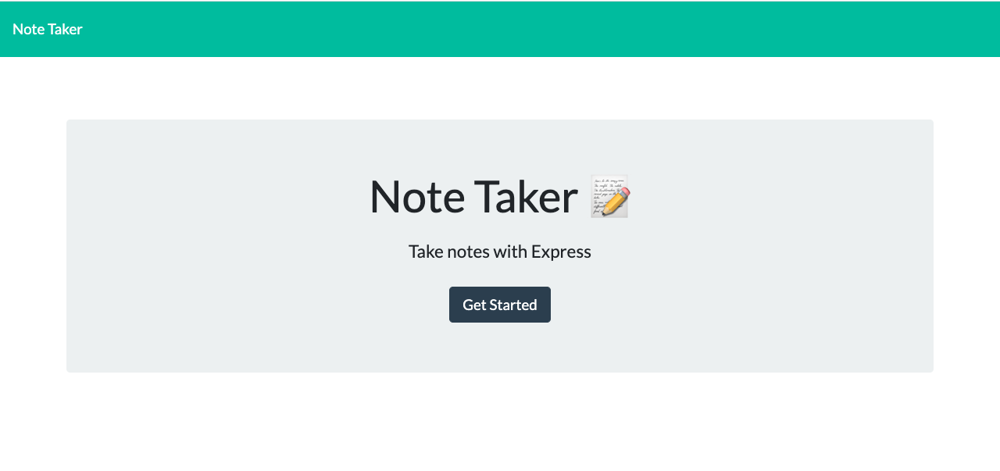
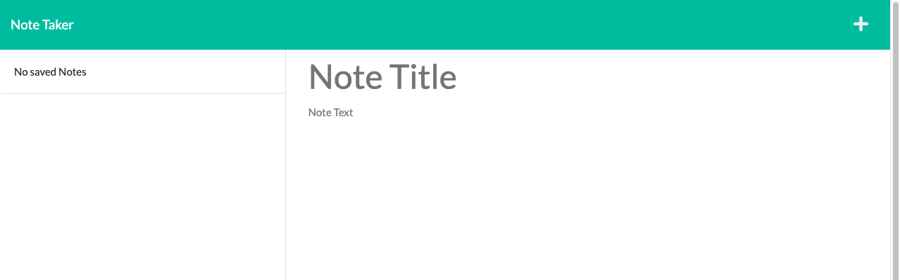

# <Note-Taker>

# Note Taker

## Summery 
This project is about to create an application called Note Taker that can be used to write and save notes.This application will use an Express.js back end and will save and retrieve note data from a JSON file.
With this application user be able to write and save notes so that they can organize their thoughts and keep track of tasks they need to complete.

## Built with

 * [HTML](https://developer.mozilla.org/en-US/docs/Web/HTML)
 * [CSS](https://developer.mozilla.org/en-US/docs/Web/CSS)
 * [JavaScript](https://developer.mozilla.org/en-US/docs/Web/JavaScript)
 * [Bootstrap](https://getbootstrap.com/)
 * [node.js](https://nodejs.org/en/)
 * [Express.js](https://expressjs.com/)

## Link
 To access to The Note Taker with node: 
 http://localhost:3001

## Mock-Up
The following images show the web application's appearance and functionality:

